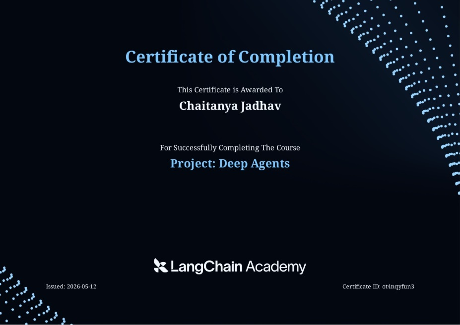

# langgraph-deep-agent

A hands-on, **"deep agents from scratch"** walkthrough built on **LangGraph + LangChain 1.x**. Each module in `src/` is a self-contained, runnable example that demonstrates one core primitive used to build production-grade agents — stateful tools, virtual filesystems, TODO planning, and sub-agent orchestration.

The goal is pedagogical: read each file top-to-bottom, run it, and inspect the auto-generated graph diagram. There is intentional duplication across modules (state classes, reducers, mock search tool) so every example stands alone.

---

## Table of Contents

- [What is a "deep agent"?](#what-is-a-deep-agent)
- [Concepts covered](#concepts-covered)
- [Project structure](#project-structure)
- [Setup](#setup)
- [How to use](#how-to-use)
- [Examples](#examples)
- [Shared infrastructure](#shared-infrastructure)
- [Conventions](#conventions)
- [Troubleshooting](#troubleshooting)

---

## What is a "deep agent"?

A *deep agent* is an LLM agent that can plan, persist context, delegate work, and operate over long horizons — as opposed to a single-shot ReAct loop. The patterns it relies on are:

1. **Stateful tools** — tools that read from and write to the graph's shared state.
2. **Virtual filesystem** — durable scratchpad stored in state, not on disk.
3. **TODO planning** — explicit task list the agent maintains, reads, and updates.
4. **Sub-agent delegation** — spawning isolated child agents so the parent's context stays clean.

Each module in this repo isolates one of these primitives.

---

## Concepts covered

| Module | Concept | Key primitives |
|---|---|---|
| `stateful_tools.py` | Tools that mutate graph state | `InjectedState`, `InjectedToolCallId`, `Command(update=...)`, custom reducers |
| `file_tools.py` | Virtual filesystem in state | `file_reducer`, `ls` / `read_file` / `write_file` tools, `DeepAgentState` |
| `planning_TODO_lists.py` | TODO-driven workflow | `Todo` TypedDict, `write_todos` / `read_todos` tools, prompt-driven planning |
| `sub_agents.py` | Context isolation via sub-agents | `_create_task_tool` factory, `task(description, subagent_type)`, isolated child invocations |

Cross-cutting themes baked into the comments and code:
- **Prompt-driven vs graph-enforced orchestration** (`planning_TODO_lists.py` header) — the trade-off between letting the LLM choose the next step vs. encoding the flow in graph nodes.
- **Context isolation** (`sub_agents.py`) — why sub-agents receive only the task description, not the parent's message history.
- **Reducers as the state-merge contract** — `file_reducer`, `reduce_list`, and `add_messages` show three different merge strategies.
- **Tool description as instruction** — descriptions in `prompts.py` (`WRITE_TODOS_DESCRIPTION`, `WRITE_FILE_DESCRIPTION`, ...) double as behavior specs the LLM reads.

---

## Project structure

```
langgraph-deep-agent/
├── src/
│   ├── stateful_tools.py        # Calculator agent w/ stateful tool
│   ├── file_tools.py            # Virtual filesystem tools
│   ├── planning_TODO_lists.py   # TODO list planning
│   ├── sub_agents.py            # Sub-agent delegation via task()
│   ├── prompts.py               # Shared prompt + tool description templates
│   ├── utils.py                 # Rich console helpers, stream_agent runner
│   └── graph_flow_diagram/      # Auto-generated PNGs of each agent graph
├── .env.example                 # Required environment variables
├── pyproject.toml               # Python ≥3.12, uv-managed
├── uv.lock
└── CLAUDE.md                    # Guidance for Claude Code in this repo
```

---

## Setup

### Prerequisites

- **Python ≥ 3.12**
- [**uv**](https://docs.astral.sh/uv/) for dependency management

### Install

```powershell
# 1. Clone the repo
git clone https://github.com/chaitanya-jadhav11/langgraph-deep-agent.git
cd langgraph-deep-agent

# 2. Install dependencies
uv sync

# 3. Configure environment variables
cp .env.example .env
# Edit .env with your API keys
```

### Environment variables

Copy `.env.example` to `.env` and fill in:

```env
# Required by stateful_tools.py
OPENAI_API_KEY=sk-...

# Required by file_tools.py, planning_TODO_lists.py, sub_agents.py
ANTHROPIC_API_KEY=sk-ant-...

# Dependency listed but web_search is mocked — only needed if you wire in real Tavily
TAVILY_API_KEY=tvly-...

# Optional tracing
LANGSMITH_API_KEY=lsv2_...
LANGSMITH_TRACING=true
LANGSMITH_PROJECT=lca-lc-foundation
```

All modules call `load_dotenv(override=True)` on import.

---

## How to use

Every module is invoked as a script via `uv run -m src.<module>` (the footer comment in each file shows the exact command). Running a module will:

1. Build the agent graph.
2. Print an ASCII rendering of the graph to stdout.
3. Save a Mermaid PNG to `src/graph_flow_diagram/<module>.png` (requires network — mermaid.ink).
4. Invoke the agent on a hardcoded example prompt.
5. Render the resulting message trace using Rich panels.

```powershell
uv run -m src.stateful_tools
uv run -m src.file_tools
uv run -m src.planning_TODO_lists
uv run -m src.sub_agents
```

To experiment, edit the `main()` block at the bottom of any module and change the user message.

---

## Examples

### 1. `stateful_tools.py` — a calculator that records its operations

Demonstrates a tool that **mutates graph state** (an `ops` history list) in addition to returning a result to the LLM.

```python
@tool
def calculator_wstate(
    operation: Literal["add", "subtract", "multiply", "divide"],
    a: float,
    b: float,
    state: Annotated[CalcState, InjectedState],          # LLM never sees this
    tool_call_id: Annotated[str, InjectedToolCallId],    # LLM never sees this
):
    ...
    return Command(update={
        "ops": [f"({operation}, {a}, {b})"],             # accumulated by reduce_list
        "messages": [ToolMessage(f"{result}", tool_call_id=tool_call_id)],
    })
```

Run: `uv run -m src.stateful_tools`
Example prompt: *"What is 3.1 * 4.2?"*

### 2. `file_tools.py` — a research agent that uses a virtual filesystem

The agent is required by its system prompt to save the user request to `user_request.txt`, run `web_search`, then `read_file` before answering. Files live in `state["files"]`, merged via `file_reducer`.

```python
class DeepAgentState(AgentState):
    todos: NotRequired[list[Todo]]
    files: Annotated[NotRequired[dict[str, str]], file_reducer]
```

Run: `uv run -m src.file_tools`
Example prompt: *"Give me an overview of Model Context Protocol (MCP)."*

### 3. `planning_TODO_lists.py` — TODO-driven research

The agent is instructed to `write_todos` first, then loop: do a task → `read_todos` → mark complete → continue. The header comments contrast this **prompt-driven** approach against a **graph-enforced** alternative (planner / execution / reflection / update nodes).

```python
class Todo(TypedDict):
    content: str
    status: Literal["pending", "in_progress", "completed"]
```

Run: `uv run -m src.planning_TODO_lists`
Example prompt: *"Research MCP, LangGraph, AutoGen, CrewAI, then compare them in a table"*

### 4. `sub_agents.py` — delegation with isolated context

A `task(description, subagent_type)` tool spawns a fresh sub-agent whose message history is **reset to just the task description**, preventing context pollution from the parent.

```python
task_tool = _create_task_tool(
    sub_agent_tools, [research_sub_agent], model, DeepAgentState
)

# Inside task(): isolate the sub-agent's context
state["messages"] = [{"role": "user", "content": description}]
result = sub_agent.invoke(state)
```

Run: `uv run -m src.sub_agents`
Example prompt: *"Give me an overview of Model Context Protocol (MCP)."*

---

## Shared infrastructure

- **`src/prompts.py`** — single source of truth for tool descriptions (`LS_DESCRIPTION`, `READ_FILE_DESCRIPTION`, `WRITE_FILE_DESCRIPTION`, `WRITE_TODOS_DESCRIPTION`) and instruction blocks (`TODO_USAGE_INSTRUCTIONS`, `FILE_USAGE_INSTRUCTIONS`, `SUBAGENT_USAGE_INSTRUCTIONS`, `RESEARCHER_INSTRUCTIONS`). Prefer editing this file over inlining prompts in modules.
- **`src/utils.py`** — Rich-console helpers:
  - `format_messages(messages)` — render a message list with colored panels per role.
  - `show_prompt(text, title)` — pretty-print a prompt with XML / markdown highlights.
  - `stream_agent(agent, query, config)` — async runner that prints per-node updates and returns the final state.

---

## Conventions

- Uses **LangChain 1.x** `create_agent` from `langchain.agents` (not the deprecated `create_react_agent`). Always pass `state_schema=DeepAgentState` so injected-state tools type-check.
- Tools that mutate state return `Command(update={...})` and **must** include a `ToolMessage` keyed by the injected `tool_call_id`. See `write_file`, `write_todos`, `calculator_wstate`.
- Tools using `@tool(parse_docstring=True)` rely on Google-style docstrings for arg schemas — don't strip them.
- The `web_search` tool in every module is **mocked** (returns a fixed MCP paragraph). To use real Tavily, swap each module's local definition — they don't share the tool.
- Header comments (ASCII flow diagrams, "prompt-driven vs graph-enforced" commentary) are teaching material — preserve them when refactoring.
- Models in use:
  - `anthropic:claude-haiku-4-5-20251001` — `file_tools`, `planning_TODO_lists`, `sub_agents`
  - `openai:gpt-4o-mini` — `stateful_tools`

---

## Troubleshooting

| Symptom | Cause / Fix |
|---|---|
| `draw_mermaid_png` raises a network error | mermaid.ink unreachable. Comment out the `draw_mermaid_png(...)` line — the agent itself runs fine without it. |
| `AuthenticationError` from OpenAI/Anthropic | Missing key in `.env`. Check which module you're running (see [Setup](#setup) for which key each module needs). |
| Tool docstring parse error | `parse_docstring=True` requires Google-style docstrings with an `Args:` block — re-add it. |
| State key not updating across tool calls | Reducer missing. Check the field's `Annotated[..., <reducer>]` declaration on the state TypedDict. |
| Sub-agent ignores parent context | That's the point — sub-agent context is intentionally isolated to the `description` argument of `task()`. |


## Course certificate
Certificate link : https://academy.langchain.com/certificates/ot4nqyfun3 

